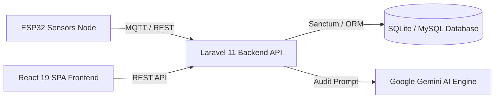

# 🏢 LetSens AIoT — Smart Sanitation & Air Quality System

[](https://php.net)
[](https://laravel.com)
[](https://react.dev)
[](https://www.typescriptlang.org)
[](#-lisensi--hak-cipta)

> **Universitas Komputer Indonesia (UNIKOM)**  
> Platform Sensing & Telemetri Sanitasi Toilet Pintar Berbasis IoT, AI (Google Gemini), dan Analytics Real-Time.

---

## 📌 Deskripsi Proyek

**LetSens AIoT** adalah platform berbasis IoT dan AI yang dikembangkan untuk memantau dan mengelola sanitasi serta kualitas udara bilik toilet secara real-time. Sistem ini mengintegrasikan data sensor gas amonia ($NH_3$), iklim mikro (suhu & kelembapan), okupansi bilik, dan otomatisasi ventilasi udara (*exhaust fan*) dengan rekomendasi audit kebersihan pintar menggunakan Google Gemini AI.

---

## 🌟 Fitur Utama

- 📡 **Telemetri Real-Time**: Ingesti data sensor dari node ESP32 via **MQTT** (HiveMQ/EMQX) dan **HTTP REST API**.
- 💨 **Otomasi Exhaust Blower**: Pemicuan relai kipas ventilasi otomatis jika amonia melebihi ambang batas ($>10\text{ PPM}$).
- 🤖 **LetSens AI Smart Audit**: Evaluasi tingkat kebersihan & prediksi konsumsi bahan habis pakai (sabun & tisu) menggunakan AI.
- 🛡️ **Role-Based Access Control (RBAC)**: Otorisasi hak akses 4 tingkatan (*Super Admin*, *Supervisor*, *Teknisi IoT*, dan *Petugas Kebersihan*).
- 📲 **WhatsApp Quick Dispatch**: Fitur penugasan otomatis ke WhatsApp petugas kebersihan saat terjadi kondisi kotor/darurat.
- 📊 **Laporan & Eksportasi**: Generasi laporan rekapitulasi audit dan inventaris dalam format **PDF** dan **Excel (.xlsx)**.

---

## 🏗️ Arsitektur & Teknologi



### **Backend**
- **Framework**: Laravel 11 (PHP 8.2+)
- **Pattern**: Clean Service Layer & Domain Isolation
- **Auth**: Laravel Sanctum (Encrypted Bearer Tokens)

### **Frontend**
- **Framework**: React 19 + Vite 6 + TypeScript 5
- **Styling**: TailwindCSS v4 + Custom Tokens
- **Components**: Framer Motion, Lucide React, Dynamic Island Toasts

### **IoT & Hardware**
- **Node**: Mikrokontroler ESP32 Dual-Core
- **Sensors**: MQ-137 ($NH_3$), SHT40 (Suhu/Kelembapan), PIR Occupancy, ADS1115 ADC
- **Actuators**: Relai Optokopler 5V Exhaust Fan

---

## 📁 Struktur Repository

```text
letsens/
├── backend/                        # Laravel 11 REST API Project
│   ├── app/
│   │   ├── Services/               # Core Business Logic Services
│   │   ├── Http/Controllers/Api/   # API Controllers & Form Requests
│   │   ├── Traits/                 # Standardized API Response Formatters
│   │   └── Models/                 # Database Schemas & Models
│   ├── database/                   # Migrations & Seeders
│   ├── routes/api.php              # API Endpoints Router
│   └── emulator.py                 # Telemetry Hardware Simulator
├── frontend/                       # React 19 Frontend SPA Project
│   ├── src/
│   │   ├── api/                    # Axios API Client & Services
│   │   ├── components/             # UI Components, Layout, Views
│   │   ├── utils/                  # RBAC Helpers & Utilities
│   │   └── pages/                  # Page Exports
│   └── public/                     # Static Assets
└── README.md                       # Main Repository Documentation
```

---

## ⚡ Cara Menjalankan (Quick Start)

### 1. Backend (Laravel API)

```bash
cd backend

# Install dependencies
composer install

# Environment setup
cp .env.example .env
php artisan key:generate

# Database setup & seeding
php artisan migrate --seed
php artisan storage:link

# Run local development server
php artisan serve
```

### 2. Frontend (React SPA)

```bash
cd frontend

# Install dependencies
npm install

# Run local development server
npm run dev
```

### 3. Hardware Simulator (Optional)

Untuk menyimulasikan pengiriman data sensor tanpa perangkat fisik ESP32:

```bash
cd backend
python3 emulator.py
```

---

## 🔌 API Endpoints (v1)

| Method | Endpoint | Deskripsi |
| :--- | :--- | :--- |
| `POST` | `/api/login` | Autentikasi pengguna & pembentukan Sanctum Token |
| `GET` | `/api/sensor-logs/latest` | Mengambil telemetry sensor terbaru seluruh bilik |
| `POST` | `/api/sensor-logs` | Ingest data telemetry sensor dari IoT node |
| `GET` | `/api/toilets` | Daftar & status bilik toilet |
| `GET` | `/api/iot-devices` | Manajemen & status perangkat ESP32 |
| `POST` | `/api/letsens-ai/analyze` | Evaluasi & analisis kebersihan berbasis Gemini AI |
| `GET` | `/api/supplies` | Data stok persediaan sabun & tisu |
| `GET` | `/api/settings` | Konfigurasi sistem & parameter MQTT |

---

## 📄 Lisensi

© 2026 **Universitas Komputer Indonesia (UNIKOM)** — Division IoT & AI Sanitation Engineering. Proprietary Software.
