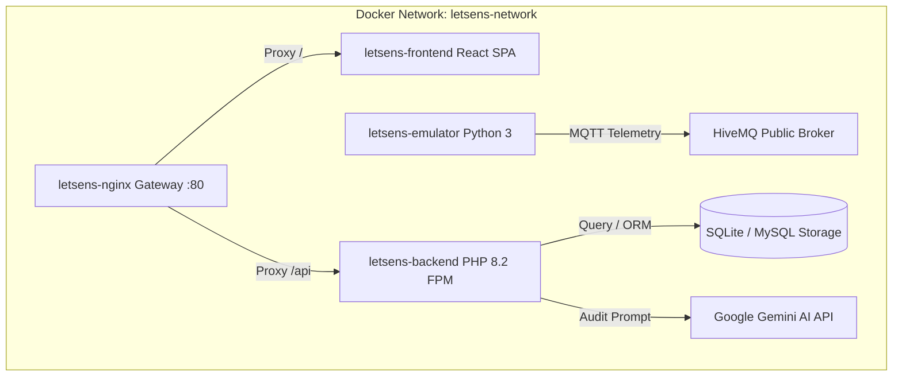

# 🏢 LetSens AIoT — Smart Sanitation & Air Quality System

[](https://php.net)
[](https://laravel.com)
[](https://react.dev)
[](https://www.typescriptlang.org)
[](https://www.docker.com)
[](#-lisensi)

> **Universitas Komputer Indonesia (UNIKOM)**
> Platform Sensing & Telemetri Sanitasi Toilet Pintar Berbasis IoT, AI (Google Gemini), dan Analytics Real-Time.

---

## 📌 Deskripsi Proyek

**LetSens AIoT** adalah platform berbasis IoT dan AI yang dikembangkan untuk memantau dan mengelola sanitasi serta kualitas udara bilik toilet secara real-time. Sistem ini mengintegrasikan data sensor gas amonia ($NH_3$), iklim mikro (suhu & kelembapan), okupansi bilik, dan otomatisasi ventilasi udara (_exhaust fan_) dengan rekomendasi audit kebersihan pintar menggunakan Google Gemini AI.

---

## 🌟 Fitur Utama

- 📡 **Telemetri Real-Time**: Ingesti data sensor dari node ESP32 via **MQTT** (HiveMQ/EMQX) dan **HTTP REST API**.
- 💨 **Otomasi Exhaust Blower**: Pemicuan relai kipas ventilasi otomatis jika amonia melebihi ambang batas ($>10\text{ PPM}$).
- 🤖 **LetSens AI Smart Audit**: Evaluasi tingkat kebersihan & prediksi konsumsi bahan habis pakai (sabun & tisu) menggunakan AI.
- 🛡️ **Role-Based Access Control (RBAC)**: Otorisasi hak akses 4 tingkatan (_Super Admin_, _Supervisor_, _Teknisi IoT_, dan _Petugas Kebersihan_).
- 📲 **WhatsApp Quick Dispatch**: Fitur penugasan otomatis ke WhatsApp petugas kebersihan saat terjadi kondisi kotor/darurat.
- 📊 **Laporan & Eksportasi**: Generasi laporan rekapitulasi audit dan inventaris dalam format **PDF** dan **Excel (.xlsx)**.
- 🐳 **Full Dockerized Architecture**: Siap dijalankan dalam 1 perintah menggunakan Docker Compose.

---

## 🐳 Deployment Cepat via Docker (Recommended)

Sistem sudah dilengkapi dengan konfigurasi **Docker & Docker Compose** multi-container:

```bash
# 1. Clone repository
git clone https://github.com/username/letsens.git
cd letsens

# 2. Jalankan seluruh layanan (Backend, Frontend, Nginx Gateway, & Emulator Hardware)
docker compose up -d --build
```

Setelah kontainer berjalan:

- 🌐 **Web Dashboard (Frontend)**: `http://localhost`
- 🔌 **Backend REST API**: `http://localhost/api`
- 📟 **Hardware Simulator**: Otomatis aktif mengirimkan data telemetri di background.

### Manajemen Container Docker:

```bash
# Cek status kontainer
docker compose ps

# Lihat log layanan real-time
docker compose logs -f

# Menghentikan kontainer
docker compose down
```

---

## 🏗️ Arsitektur & Kontainer Docker



### **Spesifikasi Kontainer**:

- `letsens-backend`: PHP 8.2 FPM Alpine (Laravel 11 REST API Engine)
- `letsens-frontend`: Nginx Alpine serving React 19 SPA static build
- `letsens-nginx`: Main Reverse Proxy & API Gateway (Port 80)
- `letsens-emulator`: Python 3 MQTT Publisher (Simulasi telemetri sensor ESP32)

---

## ⚡ Cara Menjalankan Manual Tanpa Docker (Local Development)

### 1. Backend (Laravel API)

```bash
cd backend

# Install dependencies
composer install

# Environment setup
cp .env.example .env
php artisan key:generate

# Database setup & seeding
php artisan migrate --seed
php artisan storage:link

# Run local development server
php artisan serve
```

### 2. Frontend (React SPA)

```bash
cd frontend

# Install dependencies
npm install

# Run local development server
npm run dev
```

### 3. Hardware Simulator (Optional)

```bash
cd backend
python3 emulator.py
```

---

## 📁 Struktur Repository

```text
letsens/
├── backend/                        # Laravel 11 REST API Project
│   ├── app/                        # Services, Controllers, Models
│   ├── database/                   # Migrations & Seeders
│   ├── Dockerfile                  # PHP 8.2 FPM Container Definition
│   ├── emulator.Dockerfile         # Hardware Simulator Container
│   └── emulator.py                 # Telemetry Hardware Simulator
├── frontend/                       # React 19 Frontend SPA Project
│   ├── src/                        # API Services, Components, Views
│   ├── Dockerfile                  # Multi-stage Node/Nginx Container Definition
│   └── nginx.conf                  # SPA Nginx Router Config
├── docker/
│   └── nginx/default.conf          # Main Reverse Proxy Nginx Gateway
├── docker-compose.yml              # Master Docker Orchestration File
└── README.md                       # Main Repository Documentation
```

---

## 🔌 Referensi REST API Endpoints (Aktual v1.0)

Semua endpoint terlindungi oleh middleware **Sanctum Auth** (`auth:sanctum`) dan rate limiter (`throttle:api`).

### 1. Autentikasi & Profil Pengguna (`/api/auth`)

| Method | Endpoint                                       | Deskripsi                                            |
| :----- | :--------------------------------------------- | :--------------------------------------------------- |
| `POST` | `/api/auth/login`                              | Login pengguna & penerbitan Bearer Token Sanctum     |
| `POST` | `/api/auth/logout`                             | Revokasi token autentikasi aktif                     |
| `GET`  | `/api/auth/me`                                 | Mengambil profil pengguna yang sedang terautentikasi |
| `PUT`  | `/api/auth/profile` / `/api/profile`           | Memperbarui nama, email, & foto profil (base64)      |
| `PUT`  | `/api/auth/password` / `/api/profile/password` | Memperbarui kata sandi pengguna                      |

### 2. Telemetri Sensor Real-Time (`/api/sensor-logs`)

| Method   | Endpoint                      | Deskripsi                                                    |
| :------- | :---------------------------- | :----------------------------------------------------------- |
| `GET`    | `/api/sensor-logs/latest`     | Mengambil data telemetri sensor terbaru per bilik toilet     |
| `GET`    | `/api/sensor-logs/history`    | Riwayat telemetri terfilter (rentang tanggal, toilet, limit) |
| `POST`   | `/api/sensor-logs`            | Ingest data telemetri dari mikrokontroler ESP32 / Emulator   |
| `POST`   | `/api/sensors/data`           | Endpoint alternatif ingesti data telemetri sensor            |
| `POST`   | `/api/sensor-telemetry/store` | Endpoint ingesti khusus frekuensi tinggi                     |
| `DELETE` | `/api/sensor-logs`            | Pembersihan / reset riwayat log telemetri                    |

### 3. Manajemen Bilik Toilet & Check-In Mobile (`/api/toilets`)

| Method   | Endpoint                   | Deskripsi                                                       |
| :------- | :------------------------- | :-------------------------------------------------------------- |
| `GET`    | `/api/toilets`             | Daftar seluruh bilik toilet beserta status & ambang amonia      |
| `POST`   | `/api/toilets`             | Penambahan bilik toilet baru                                    |
| `GET`    | `/api/toilets/{id}`        | Detail informasi spesifik bilik toilet                          |
| `PUT`    | `/api/toilets/{id}`        | Memperbarui parameter bilik (nama, lokasi, ambang batas amonia) |
| `DELETE` | `/api/toilets/{id}`        | Menghapus data bilik toilet                                     |
| `GET`    | `/api/toilets/{id}/qrcode` | Generate QR Code unik untuk identifikasi bilik                  |
| `POST`   | `/api/toilets/check-in`    | Check-in pembersihan bilik oleh petugas via scan QR             |
| `POST`   | `/api/toilets/check-out`   | Check-out petugas setelah pembersihan selesai                   |

### 4. Perangkat IoT & Remote Command (`/api/iot-devices`)

| Method   | Endpoint                           | Deskripsi                                            |
| :------- | :--------------------------------- | :--------------------------------------------------- |
| `GET`    | `/api/iot-devices`                 | Inventaris seluruh perangkat hardware ESP32          |
| `POST`   | `/api/iot-devices`                 | Pendaftaran node hardware IoT baru                   |
| `GET`    | `/api/iot-devices/{id}`            | Detail status koneksi & sensor perangkat             |
| `PUT`    | `/api/iot-devices/{id}`            | Update konfigurasi perangkat                         |
| `DELETE` | `/api/iot-devices/{id}`            | Menghapus perangkat IoT                              |
| `POST`   | `/api/iot-devices/{id}/reboot`     | Perintah remote reboot perangkat ESP32               |
| `POST`   | `/api/iot-devices/{id}/calibrate`  | Kalibrasi nol sensor gas amonia MQ-137 / ADC ADS1115 |
| `POST`   | `/api/iot-devices/{id}/ota-update` | Trigger Over-The-Air (OTA) update firmware           |

### 5. Petugas Sanitasi & WhatsApp Dispatch (`/api/staff`)

| Method   | Endpoint                 | Deskripsi                                               |
| :------- | :----------------------- | :------------------------------------------------------ |
| `GET`    | `/api/staff`             | Daftar seluruh petugas kebersihan & teknisi             |
| `POST`   | `/api/staff`             | Pendaftaran akun petugas baru                           |
| `GET`    | `/api/staff/{id}`        | Detail profil & nomor kontak petugas                    |
| `PUT`    | `/api/staff/{id}`        | Memperbarui data petugas                                |
| `DELETE` | `/api/staff/{id}`        | Menghapus akun petugas                                  |
| `POST`   | `/api/dispatch/whatsapp` | Pengiriman instruksi tugas otomatis ke WhatsApp petugas |

### 6. Inventaris Stok & Supplies (`/api/supplies`)

| Method   | Endpoint                   | Deskripsi                                             |
| :------- | :------------------------- | :---------------------------------------------------- |
| `GET`    | `/api/supplies`            | Pemantauan stok persediaan sabun, tisu, & desinfektan |
| `POST`   | `/api/supplies`            | Pendaftaran item stok persediaan baru                 |
| `GET`    | `/api/supplies/{id}`       | Detail level persediaan item                          |
| `PUT`    | `/api/supplies/{id}`       | Memperbarui item persediaan                           |
| `DELETE` | `/api/supplies/{id}`       | Menghapus item persediaan                             |
| `PATCH`  | `/api/supplies/{id}/stock` | Penyesuaian persentase / jumlah stok cepat            |

### 7. Jadwal Pemeliharaan & Tiket Kerusakan (`/api/schedules`, `/api/damages`, `/api/repairs`)

| Method  | Endpoint                        | Deskripsi                                                        |
| :------ | :------------------------------ | :--------------------------------------------------------------- |
| `GET`   | `/api/schedules`                | Daftar jadwal pembersihan rutin per bilik                        |
| `POST`  | `/api/schedules`                | Membuat jadwal pembersihan baru                                  |
| `PATCH` | `/api/schedules/{id}/checklist` | Toggle status item checklist pembersihan                         |
| `POST`  | `/api/schedules/{id}/complete`  | Menyelesaikan & menutup tiket pembersihan                        |
| `GET`   | `/api/damages`                  | Pelaporan kerusakan komponen fasilitas toilet                    |
| `POST`  | `/api/damages`                  | Mengajukan laporan kerusakan baru                                |
| `POST`  | `/api/damages/{id}/dispatch`    | Disposisi laporan kerusakan ke tiket perbaikan teknisi           |
| `GET`   | `/api/repairs`                  | Daftar tiket perbaikan teknisi IoT / Fasilitas                   |
| `PATCH` | `/api/repairs/{id}/status`      | Memperbarui status perbaikan (_pending, in_progress, completed_) |

### 8. LetSens AI Smart Analytics (`/api/letsens-ai`)

| Method | Endpoint                  | Deskripsi                                                             |
| :----- | :------------------------ | :-------------------------------------------------------------------- |
| `POST` | `/api/letsens-ai/analyze` | Analisis kualitas udara, deteksi anomali bau, & rekomendasi Gemini AI |

### 9. Pengaturan & Log Aktivitas (`/api/settings`, `/api/activity-logs`)

| Method   | Endpoint                    | Deskripsi                                                      |
| :------- | :-------------------------- | :------------------------------------------------------------- |
| `GET`    | `/api/settings`             | Mengambil seluruh konfigurasi sistem (`system`, `app`, `mqtt`) |
| `GET`    | `/api/settings/{group}`     | Mengambil konfigurasi spesifik grup                            |
| `PUT`    | `/api/settings/{group}`     | Memperbarui parameter konfigurasi grup                         |
| `POST`   | `/api/settings/mqtt/test`   | Pengujian koneksi broker MQTT                                  |
| `POST`   | `/api/settings/gemini/test` | Pengujian API Key Google Gemini AI                             |
| `GET`    | `/api/activity-logs`        | Mengambil audit log aktivitas pengguna                         |
| `POST`   | `/api/activity-logs`        | Mencatat log aktivitas baru                                    |
| `DELETE` | `/api/activity-logs`        | Pembersihan audit log aktivitas                                |

---

## 📄 Lisensi

© 2026 **Universitas Komputer Indonesia** — Division IoT & AI Sanitation Engineering. Proprietary Software.
