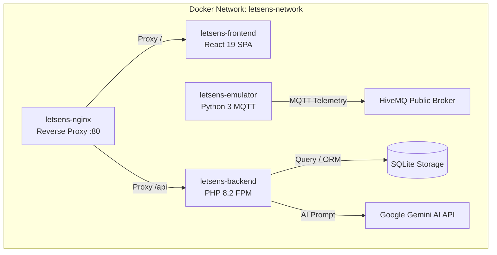

# 🏢 LetSens AIoT — Smart Sanitation & Air Quality System

[](https://php.net)
[](https://laravel.com)
[](https://react.dev)
[](https://www.typescriptlang.org)
[](#-lisensi)

> Platform Sensing & Telemetri Sanitasi Toilet Pintar Berbasis IoT, AI (Google Gemini), dan Analytics Real-Time — Universitas Komputer Indonesia (UNIKOM).

---

## 📌 Deskripsi Proyek

**LetSens AIoT** adalah platform berbasis IoT dan Kecerdasan Buatan yang dikembangkan untuk memantau dan mengelola sanitasi serta kualitas udara bilik toilet secara real-time. Sistem mengintegrasikan data sensor gas amonia (NH₃), iklim mikro (suhu & kelembapan), okupansi bilik, dan otomatisasi ventilasi udara (*exhaust fan*) dengan rekomendasi audit kebersihan pintar menggunakan Google Gemini AI.

---

## 🌟 Fitur Utama

- 📡 **Telemetri Real-Time** — Ingesti data sensor dari node ESP32 via MQTT (HiveMQ/EMQX) dan HTTP REST API.
- 💨 **Otomasi Exhaust Blower** — Pemicuan relai kipas ventilasi otomatis jika amonia melebihi ambang batas (>10 PPM).
- 🤖 **LetSens AI Smart Audit** — Evaluasi tingkat kebersihan & prediksi konsumsi bahan habis pakai menggunakan Google Gemini AI.
- 🛡️ **Role-Based Access Control (RBAC)** — 4 level otorisasi: *Super Admin*, *Supervisor / Manajer*, *Teknisi IoT*, dan *Petugas Kebersihan*.
- 📲 **WhatsApp Quick Dispatch** — Penugasan otomatis ke WhatsApp petugas saat terjadi kondisi kotor/darurat.
- 📊 **Laporan & Eksportasi** — Generasi laporan rekapitulasi audit dan inventaris dalam format PDF dan Excel (.xlsx).
- 🔧 **Manajemen Kerusakan & Perbaikan** — Pelaporan kerusakan fasilitas, disposisi ke tiket perbaikan, dan pelacakan status teknisi.
- 📅 **Jadwal Pemeliharaan** — Penjadwalan pembersihan rutin per bilik dengan checklist item dan penyelesaian tugas.
- 📦 **Inventaris Stok** — Pemantauan level persediaan sabun, tisu, dan desinfektan dengan penyesuaian stok cepat.
- 🏗️ **Glosarium & Fasilitas** — Manajemen master data fasilitas sanitasi toilet dan kamus istilah teknis sistem.

---

## 🏗️ Arsitektur Sistem



### Kontainer Docker (`docker-compose.yml`)

| Kontainer | Deskripsi |
| :--- | :--- |
| `letsens-backend` | PHP 8.2 FPM Alpine — Laravel 11 REST API Engine |
| `letsens-frontend` | Nginx Alpine — React 19 SPA static build |
| `letsens-nginx` | Main Reverse Proxy & API Gateway (Port 80) |
| `letsens-emulator` | Python 3 MQTT Publisher — Simulasi telemetri sensor ESP32 |

---

## 📁 Struktur Repository

```text
letsens/
├── backend/                          # Laravel 11 REST API
│   ├── app/
│   │   ├── Http/Controllers/Api/     # 12 Controller REST API
│   │   ├── Models/                   # 12 Eloquent Model
│   │   └── Services/                 # Business Logic Layer
│   ├── database/
│   │   ├── migrations/               # 17 Migration Files
│   │   └── seeders/                  # DatabaseSeeder, SettingSeeder, ActivityLogSeeder
│   ├── routes/api.php                # 76 API Route Definitions
│   ├── emulator.py                   # Hardware Telemetry Simulator
│   ├── Dockerfile                    # PHP 8.2 FPM Container
│   └── emulator.Dockerfile           # Python Simulator Container
├── frontend/                         # React 19 + TypeScript SPA
│   ├── src/
│   │   ├── api/                      # 11 API Service Modules
│   │   ├── components/
│   │   │   ├── layout/               # Sidebar, TopHeader
│   │   │   └── views/                # 21 View Components
│   │   ├── utils/rbac.ts             # Role-Based Access Control Logic
│   │   └── App.tsx                   # Root SPA Router & State
│   ├── Dockerfile                    # Multi-stage Node/Nginx Container
│   └── nginx.conf                    # SPA Routing Config
├── docker/
│   └── nginx/default.conf            # Reverse Proxy Gateway Config
├── docs/                             # Dokumentasi & Laporan QC
├── docker-compose.yml                # Master Docker Orchestration
├── .dockerignore                     # Docker Build Exclusions
└── README.md                         # Dokumentasi Repository
```

---

## 🛡️ Role-Based Access Control (RBAC)

Akses menu sidebar dan fitur terbatas berdasarkan peran pengguna:

| Role | Akses Menu |
| :--- | :--- |
| **Super Admin** | Seluruh menu (21 halaman): Dasbor, Data Sensor, Jadwal Pemeliharaan, Rekap Kerusakan, Rekap Perbaikan, Fasilitas, Bilik Toilet, Perangkat, Pengguna, Stok Perlengkapan, LetSens AI, Laporan, Log Aktivitas, Pengaturan, Glosarium, Tentang, Profil |
| **Supervisor / Manajer** | Dasbor, Data Sensor, Jadwal Pemeliharaan, Rekap Kerusakan, Rekap Perbaikan, Fasilitas, Bilik Toilet, Pengguna, Stok Perlengkapan, LetSens AI, Laporan, Glosarium, Tentang, Profil |
| **Teknisi IoT** | Dasbor, Data Sensor, Rekap Kerusakan, Rekap Perbaikan, Perangkat, Fasilitas, LetSens AI, Glosarium, Tentang, Profil |
| **Petugas Kebersihan** | Dasbor, Jadwal Pemeliharaan, Rekap Kerusakan, Rekap Perbaikan, Stok Perlengkapan, Glosarium, Tentang, Profil |

---

## ⚡ Quick Start (Local Development)

### Backend (Laravel API)

```bash
cd backend
composer install
cp .env.example .env
php artisan key:generate
php artisan migrate --seed
php artisan storage:link
php artisan serve
```

### Frontend (React SPA)

```bash
cd frontend
npm install
npm run dev
```

### Hardware Simulator (Opsional)

```bash
cd backend
python3 emulator.py
```

---

## 🔌 REST API Endpoints — Aktual (76 Routes)

Seluruh endpoint terlindungi oleh middleware **Laravel Sanctum** (`auth:sanctum`) dan rate limiter (`throttle:api`), kecuali login dan endpoint ingesti sensor frekuensi tinggi (`throttle:sensor-ingestion`).

---

### 1. Autentikasi & Profil Pengguna

| Method | Endpoint | Controller | Deskripsi |
| :--- | :--- | :--- | :--- |
| `POST` | `/api/auth/login` | `AuthController@login` | Login & penerbitan Bearer Token Sanctum |
| `POST` | `/api/auth/logout` | `AuthController@logout` | Revokasi token autentikasi aktif |
| `GET` | `/api/auth/me` | `AuthController@me` | Profil pengguna yang sedang terautentikasi |
| `PUT` | `/api/auth/profile` | `AuthController@updateProfile` | Perbarui nama, email, & foto profil |
| `PUT` | `/api/auth/password` | `AuthController@updatePassword` | Perbarui kata sandi pengguna |
| `PUT` | `/api/profile` | `AuthController@updateProfile` | Alias endpoint update profil |
| `PUT` | `/api/profile/password` | `AuthController@updatePassword` | Alias endpoint update password |
| `GET` | `/api/user` | Closure (Sanctum) | Endpoint standar Laravel Sanctum |

---

### 2. Telemetri Sensor Real-Time

| Method | Endpoint | Controller | Deskripsi |
| :--- | :--- | :--- | :--- |
| `GET` | `/api/sensor-logs/latest` | `SensorTelemetryController@latest` | Data telemetri sensor terbaru per bilik |
| `GET` | `/api/sensor-logs/history` | `SensorTelemetryController@history` | Riwayat telemetri (filter tanggal, toilet, limit) |
| `POST` | `/api/sensor-logs` | `SensorTelemetryController@store` | Ingest data dari ESP32 / Emulator |
| `POST` | `/api/sensors/data` | `SensorTelemetryController@store` | Endpoint alternatif ingesti sensor |
| `POST` | `/api/sensor-telemetry/store` | `SensorTelemetryController@store` | Endpoint ingesti frekuensi tinggi |
| `DELETE` | `/api/sensor-logs` | `SensorTelemetryController@clear` | Reset riwayat log telemetri |
| `GET` | `/api/latest-sensor-data` | Closure | Shortcut data sensor terbaru |

---

### 3. Bilik Toilet & Mobile Check-In/Check-Out

| Method | Endpoint | Controller | Deskripsi |
| :--- | :--- | :--- | :--- |
| `GET` | `/api/toilets` | `ToiletController@index` | Daftar seluruh bilik toilet & status |
| `POST` | `/api/toilets` | `ToiletController@store` | Tambah bilik toilet baru |
| `GET` | `/api/toilets/{toilet}` | `ToiletController@show` | Detail spesifik bilik toilet |
| `PUT/PATCH` | `/api/toilets/{toilet}` | `ToiletController@update` | Perbarui parameter bilik |
| `DELETE` | `/api/toilets/{toilet}` | `ToiletController@destroy` | Hapus bilik toilet |
| `GET` | `/api/toilets/{id}/qrcode` | `ToiletController@getQrCode` | Generate QR Code identifikasi bilik |
| `POST` | `/api/toilets/check-in` | `ToiletController@checkIn` | Check-in pembersihan bilik via scan QR |
| `POST` | `/api/toilets/check-out` | `ToiletController@checkOut` | Check-out petugas setelah selesai |

---

### 4. Perangkat IoT & Remote Command

| Method | Endpoint | Controller | Deskripsi |
| :--- | :--- | :--- | :--- |
| `GET` | `/api/iot-devices` | `IotDeviceController@index` | Inventaris perangkat ESP32 |
| `POST` | `/api/iot-devices` | `IotDeviceController@store` | Daftarkan node hardware baru |
| `GET` | `/api/iot-devices/{iot_device}` | `IotDeviceController@show` | Detail status & sensor perangkat |
| `PUT/PATCH` | `/api/iot-devices/{iot_device}` | `IotDeviceController@update` | Update konfigurasi perangkat |
| `DELETE` | `/api/iot-devices/{iot_device}` | `IotDeviceController@destroy` | Hapus perangkat IoT |
| `POST` | `/api/iot-devices/{id}/reboot` | `IotDeviceController@reboot` | Remote reboot ESP32 |
| `POST` | `/api/iot-devices/{id}/calibrate` | `IotDeviceController@calibrate` | Kalibrasi sensor gas MQ-137 / ADC ADS1115 |
| `POST` | `/api/iot-devices/{id}/ota-update` | `IotDeviceController@otaUpdate` | Over-The-Air firmware update |

---

### 5. Petugas Sanitasi & WhatsApp Dispatch

| Method | Endpoint | Controller | Deskripsi |
| :--- | :--- | :--- | :--- |
| `GET` | `/api/staff` | `StaffController@index` | Daftar petugas kebersihan & teknisi |
| `POST` | `/api/staff` | `StaffController@store` | Daftarkan petugas baru |
| `GET` | `/api/staff/{staff}` | `StaffController@show` | Detail profil & kontak petugas |
| `PUT/PATCH` | `/api/staff/{staff}` | `StaffController@update` | Perbarui data petugas |
| `DELETE` | `/api/staff/{staff}` | `StaffController@destroy` | Hapus akun petugas |
| `POST` | `/api/dispatch/whatsapp` | `StaffController@dispatchWhatsapp` | Kirim instruksi tugas ke WhatsApp petugas |

---

### 6. Inventaris Stok & Supplies

| Method | Endpoint | Controller | Deskripsi |
| :--- | :--- | :--- | :--- |
| `GET` | `/api/supplies` | `SupplyController@index` | Stok sabun, tisu, & desinfektan |
| `POST` | `/api/supplies` | `SupplyController@store` | Tambah item persediaan baru |
| `GET` | `/api/supplies/{supply}` | `SupplyController@show` | Detail level persediaan |
| `PUT/PATCH` | `/api/supplies/{supply}` | `SupplyController@update` | Perbarui item persediaan |
| `DELETE` | `/api/supplies/{supply}` | `SupplyController@destroy` | Hapus item persediaan |
| `PATCH` | `/api/supplies/{id}/stock` | `SupplyController@adjustStock` | Penyesuaian stok cepat |

---

### 7. Jadwal Pemeliharaan

| Method | Endpoint | Controller | Deskripsi |
| :--- | :--- | :--- | :--- |
| `GET` | `/api/schedules` | `MaintenanceScheduleController@index` | Daftar jadwal pembersihan rutin |
| `POST` | `/api/schedules` | `MaintenanceScheduleController@store` | Buat jadwal pembersihan baru |
| `GET` | `/api/schedules/{schedule}` | `MaintenanceScheduleController@show` | Detail jadwal spesifik |
| `PUT/PATCH` | `/api/schedules/{schedule}` | `MaintenanceScheduleController@update` | Perbarui jadwal |
| `DELETE` | `/api/schedules/{schedule}` | `MaintenanceScheduleController@destroy` | Hapus jadwal |
| `PATCH` | `/api/schedules/{id}/checklist` | `MaintenanceScheduleController@toggleChecklist` | Toggle status item checklist |
| `POST` | `/api/schedules/{id}/complete` | `MaintenanceScheduleController@complete` | Selesaikan & tutup jadwal |

---

### 8. Laporan Kerusakan Fasilitas

| Method | Endpoint | Controller | Deskripsi |
| :--- | :--- | :--- | :--- |
| `GET` | `/api/damages` | `DamageReportController@index` | Daftar laporan kerusakan |
| `POST` | `/api/damages` | `DamageReportController@store` | Ajukan laporan kerusakan baru |
| `GET` | `/api/damages/{damage}` | `DamageReportController@show` | Detail kerusakan spesifik |
| `PUT/PATCH` | `/api/damages/{damage}` | `DamageReportController@update` | Perbarui laporan kerusakan |
| `DELETE` | `/api/damages/{damage}` | `DamageReportController@destroy` | Hapus laporan kerusakan |
| `POST` | `/api/damages/{id}/dispatch` | `DamageReportController@dispatchToRepair` | Disposisi ke tiket perbaikan teknisi |

---

### 9. Tiket Perbaikan

| Method | Endpoint | Controller | Deskripsi |
| :--- | :--- | :--- | :--- |
| `GET` | `/api/repairs` | `RepairTicketController@index` | Daftar tiket perbaikan |
| `POST` | `/api/repairs` | `RepairTicketController@store` | Buat tiket perbaikan baru |
| `GET` | `/api/repairs/{repair}` | `RepairTicketController@show` | Detail tiket perbaikan |
| `PUT/PATCH` | `/api/repairs/{repair}` | `RepairTicketController@update` | Perbarui tiket perbaikan |
| `DELETE` | `/api/repairs/{repair}` | `RepairTicketController@destroy` | Hapus tiket perbaikan |
| `PATCH` | `/api/repairs/{id}/status` | `RepairTicketController@updateStatus` | Update status (pending → in_progress → completed) |

---

### 10. Fasilitas Sanitasi (Glosarium Data Utilitas)

| Method | Endpoint | Controller | Deskripsi |
| :--- | :--- | :--- | :--- |
| `GET` | `/api/fasilitas` | `FasilitasController@index` | Daftar master data fasilitas toilet |
| `POST` | `/api/fasilitas` | `FasilitasController@store` | Tambah entry fasilitas baru |
| `GET` | `/api/fasilitas/{fasilita}` | `FasilitasController@show` | Detail fasilitas spesifik |
| `PUT/PATCH` | `/api/fasilitas/{fasilita}` | `FasilitasController@update` | Perbarui data fasilitas |
| `DELETE` | `/api/fasilitas/{fasilita}` | `FasilitasController@destroy` | Hapus entry fasilitas |

---

### 11. LetSens AI Smart Analytics

| Method | Endpoint | Controller | Deskripsi |
| :--- | :--- | :--- | :--- |
| `POST` | `/api/letsens-ai/analyze` | `LetsensAiController@analyze` | Analisis kualitas udara & rekomendasi Gemini AI |

---

### 12. Pengaturan Sistem

| Method | Endpoint | Controller | Deskripsi |
| :--- | :--- | :--- | :--- |
| `GET` | `/api/settings` | `SettingController@index` | Seluruh konfigurasi (system, app, mqtt) |
| `GET` | `/api/settings/{group}` | `SettingController@show` | Konfigurasi spesifik per grup |
| `PUT` | `/api/settings/{group}` | `SettingController@update` | Perbarui parameter konfigurasi grup |
| `POST` | `/api/settings/mqtt/test` | `SettingController@testMqtt` | Pengujian koneksi broker MQTT |
| `POST` | `/api/settings/gemini/test` | `SettingController@testGeminiKey` | Pengujian API Key Google Gemini AI |

---

### 13. Log Aktivitas (Audit Trail)

| Method | Endpoint | Controller | Deskripsi |
| :--- | :--- | :--- | :--- |
| `GET` | `/api/activity-logs` | `ActivityLogController@index` | Audit log aktivitas pengguna |
| `POST` | `/api/activity-logs` | `ActivityLogController@store` | Catat log aktivitas baru |
| `DELETE` | `/api/activity-logs` | `ActivityLogController@destroy` | Pembersihan audit log |

---

## 🗃️ Data Model (Eloquent ORM)

| Model | Tabel | Deskripsi |
| :--- | :--- | :--- |
| `User` | `users` | Akun pengguna dengan RBAC & foto profil |
| `Toilet` | `toilets` | Bilik toilet, lokasi, ambang amonia |
| `IotDevice` | `iot_devices` | Node hardware ESP32 |
| `SensorLog` | `sensor_logs` | Log telemetri sensor (NH₃, suhu, kelembapan) |
| `Staff` | `staff` | Petugas kebersihan & teknisi |
| `Supply` | `supplies` | Inventaris stok (sabun, tisu, desinfektan) |
| `MaintenanceSchedule` | `maintenance_schedules` | Jadwal pembersihan rutin |
| `DamageReport` | `damage_reports` | Laporan kerusakan fasilitas |
| `RepairTicket` | `repair_tickets` | Tiket perbaikan teknisi |
| `Fasilitas` | `fasilitas` | Master data fasilitas sanitasi |
| `Setting` | `settings` | Konfigurasi sistem (MQTT, AI, Aplikasi) |
| `ActivityLog` | `activity_logs` | Audit trail aktivitas pengguna |

---

## 🖥️ Halaman Frontend (21 Views)

| View | Sidebar Menu | Grup |
| :--- | :--- | :--- |
| `DashboardView` | Dasbor | Operasional |
| `DataSensorView` | Data Sensor | Operasional |
| `JadwalPemeliharaanView` | Jadwal Pemeliharaan | Operasional |
| `RekapKerusakanView` | Rekap Kerusakan | Operasional |
| `RekapPerbaikanView` | Rekap Perbaikan | Operasional |
| `FasilitasView` | Fasilitas | Manajemen |
| `ManajemenToiletView` | Bilik Toilet | Manajemen |
| `ManajemenPerangkatIoTView` | Perangkat | Manajemen |
| `ManajemenPetugasView` | Pengguna | Manajemen |
| `ManajemenPerlengkapanView` | Stok Perlengkapan | Manajemen |
| `LetsensAIView` | LetSensAI | Analitik |
| `LaporanView` | Laporan | Sistem |
| `LogsView` | Log Aktivitas | Sistem |
| `PengaturanView` | Pengaturan | Sistem |
| `PengaturanSistemView` | (Sub-Pengaturan) | Sistem |
| `PengaturanAplikasiView` | (Sub-Pengaturan) | Sistem |
| `DataUtilitasView` | (Alias Fasilitas) | Manajemen |
| `GlosariumView` | Glosarium | Bantuan |
| `TentangView` | Tentang | Bantuan |
| `ProfileView` | Profil Saya | (Header) |
| `NotFoundView` | 404 | (Fallback) |

---

## 📄 Lisensi

© 2026 **LetSens AIoT** — Universitas Komputer Indonesia (UNIKOM). Proprietary Software.
